# Lab 6: Scale and Load Balance Your Architecture

## Overview

In this lab, I configured a scalable and highly available web application architecture using Elastic Load Balancing (ELB), Auto Scaling, Amazon Machine Images (AMI), and Amazon CloudWatch. I created an AMI from an existing EC2 web server, configured an Application Load Balancer, created a launch template and an Auto Scaling group, and tested automatic scaling based on CPU utilization.

Elastic Load Balancing automatically distributes incoming traffic across multiple EC2 instances to improve application availability and fault tolerance. Amazon EC2 Auto Scaling automatically adjusts the number of running instances based on demand and CloudWatch metrics.

After completing this lab, I was able to:

* Create an Amazon Machine Image (AMI)
* Configure an Application Load Balancer
* Create a target group
* Create a launch template
* Configure an Auto Scaling group
* Automatically scale EC2 instances based on CPU usage
* Monitor infrastructure using Amazon CloudWatch alarms
* Verify load balancing and scaling functionality

---

# Architecture Diagram

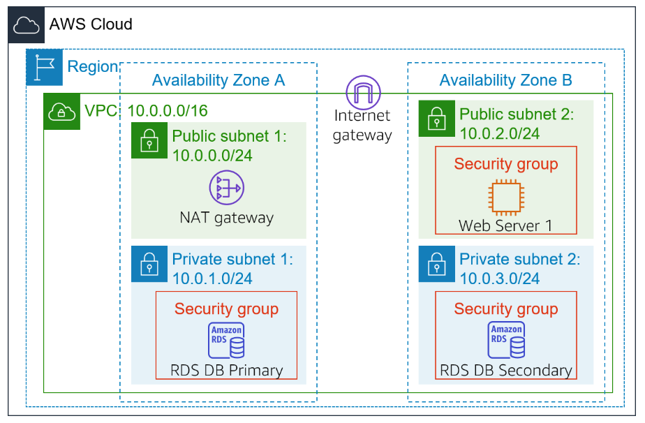

---

# Final Architecture

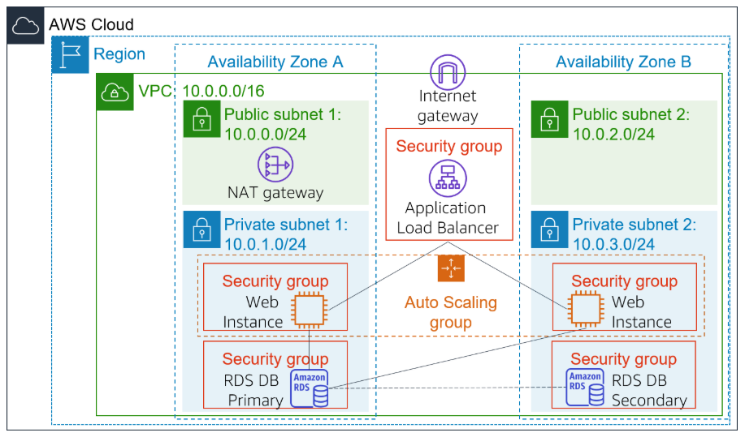

---

# Task 1: Create an AMI for Auto Scaling

In the AWS Management Console, I navigated to:

```text
Services → EC2 → Instances
```

I verified that the instance:

```text
Web Server 1
```

was running and passed:

```text
2/2 status checks
```

---

## Create the AMI

I selected:

```text
Actions → Image and templates → Create image
```

and configured the following settings:

| Configuration Setting | Value                  |
| --------------------- | ---------------------- |
| Image name            | WebServerAMI           |
| Image description     | Lab AMI for Web Server |

I selected:

```text
Create image
```

### Result

The AMI was successfully created.

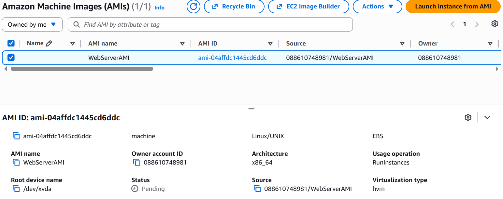

---

# Task 2: Create a Load Balancer

## Create a Target Group

In the AWS Management Console, I navigated to:

```text
Services → EC2 → Target Groups
```

I selected:

```text
Create target group
```

and configured the following settings:

| Configuration Setting | Value     |
| --------------------- | --------- |
| Target type           | Instances |
| Target group name     | LabGroup  |
| VPC                   | Lab VPC   |

I selected:

```text
Next
```

Since no Auto Scaling instances existed yet, I skipped target registration.

I selected:

```text
Create target group
```

### Result

The target group was successfully created.

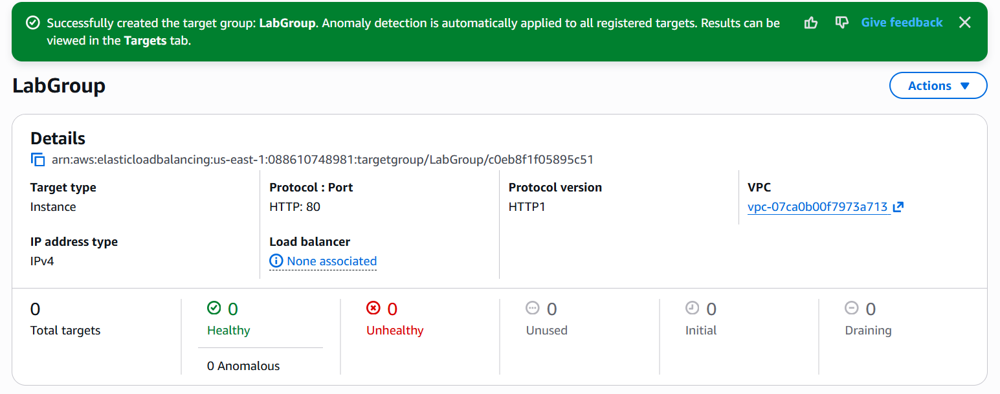

---

## Create an Application Load Balancer

In the AWS Management Console, I navigated to:

```text
Services → EC2 → Load Balancers
```

I selected:

```text
Create load balancer
```

Under:

```text
Application Load Balancer
```

I selected:

```text
Create
```

and configured the following settings:

| Configuration Setting | Value   |
| --------------------- | ------- |
| Load balancer name    | LabELB  |
| VPC                   | Lab VPC |

---

## Configure Network Mapping

I selected the following subnets:

| Availability Zone        | Subnet          |
| ------------------------ | --------------- |
| First Availability Zone  | Public Subnet 1 |
| Second Availability Zone | Public Subnet 2 |

---

## Configure Security Groups

I selected:

```text
Web Security Group
```

and removed the default security group.

---

## Configure Listener and Routing

| Listener | Default Action      |
| -------- | ------------------- |
| HTTP:80  | Forward to LabGroup |

I selected:

```text
Create load balancer
```

### Result

The Application Load Balancer was successfully created.

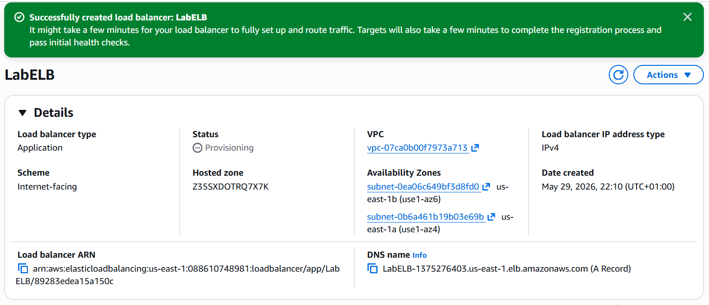

---

# Task 3: Create a Launch Template and an Auto Scaling Group

## Create a Launch Template

In the AWS Management Console, I navigated to:

```text
Services → EC2 → Launch Templates
```

I selected:

```text
Create launch template
```

and configured the following settings:

| Configuration Setting | Value              |
| --------------------- | ------------------ |
| Launch template name  | LabConfig          |
| AMI                   | WebServerAMI       |
| Instance type         | t2.micro           |
| Key pair              | vockey             |
| Security group        | Web Security Group |

---

## Configure Advanced Details

I enabled:

```text
Detailed CloudWatch monitoring
```

I selected:

```text
Create launch template
```

### Result

The launch template was successfully created.

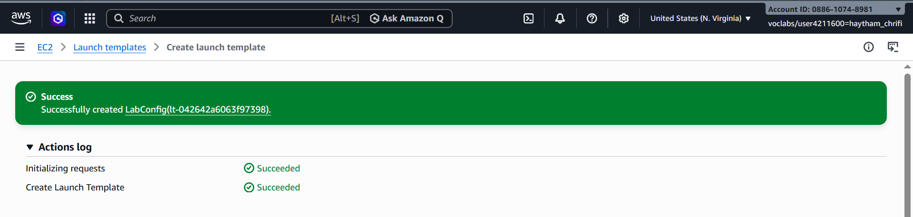

---

## Create the Auto Scaling Group

From the launch template page, I selected:

```text
Actions → Create Auto Scaling group
```

and configured the following settings:

| Configuration Setting   | Value                              |
| ----------------------- | ---------------------------------- |
| Auto Scaling group name | Lab Auto Scaling Group             |
| Launch template         | LabConfig                          |
| VPC                     | Lab VPC                            |
| Subnets                 | Private Subnet 1, Private Subnet 2 |

I selected:

```text
Next
```

---

## Attach the Load Balancer

| Configuration Setting | Value                  |
| --------------------- | ---------------------- |
| Load balancer         | Existing load balancer |
| Target group          | LabGroup               |

I enabled:

```text
Enable group metrics collection within CloudWatch
```

---

## Configure Group Size

| Configuration Setting | Value |
| --------------------- | ----- |
| Desired capacity      | 2     |
| Minimum capacity      | 2     |
| Maximum capacity      | 6     |

---

## Configure Scaling Policy

| Configuration Setting | Value                   |
| --------------------- | ----------------------- |
| Scaling policy name   | LabScalingPolicy        |
| Metric type           | Average CPU Utilization |
| Target value          | 60                      |

I selected:

```text
Create Auto Scaling group
```

### Result

The Auto Scaling group was successfully created.

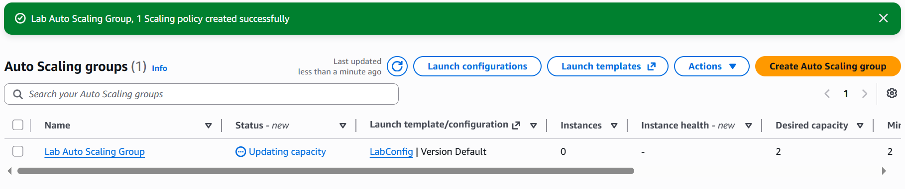

---

# Task 4: Verify that Load Balancing is Working

In the AWS Management Console, I navigated to:

```text
Services → EC2 → Instances
```

I verified that two new EC2 instances named:

```text
Lab Instance
```

were automatically launched by the Auto Scaling group.

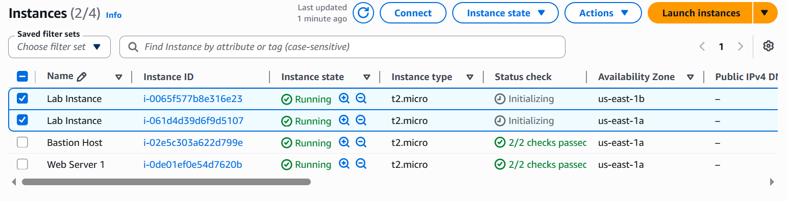

---

## Verify Target Group Health Checks

I navigated to:

```text
Services → EC2 → Target Groups → LabGroup → Targets
```

I verified that both targets displayed the status:

```text
Healthy
```

### Result

The load balancer health checks passed successfully.

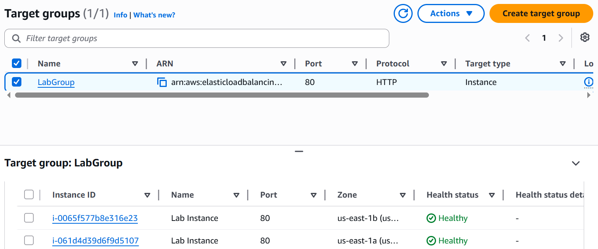

---

## Access the Application Through the Load Balancer

I navigated to:

```text
Services → EC2 → Load Balancers
```

I copied the DNS name of:

```text
LabELB
```

Example:

```text
LabELB-1998580470.us-west-2.elb.amazonaws.com
```

I opened the DNS name in a web browser.

### Result

The web application loaded successfully through the load balancer.

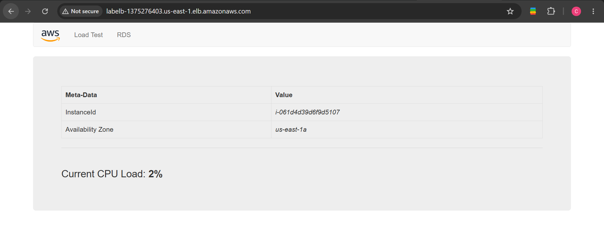

---

# Task 5: Test Auto Scaling

In the AWS Management Console, I navigated to:

```text
Services → CloudWatch → All alarms
```

I verified that the Auto Scaling group automatically created CloudWatch alarms.

Initially:

* AlarmHigh was in the `OK` state
* AlarmLow was in the `ALARM` state

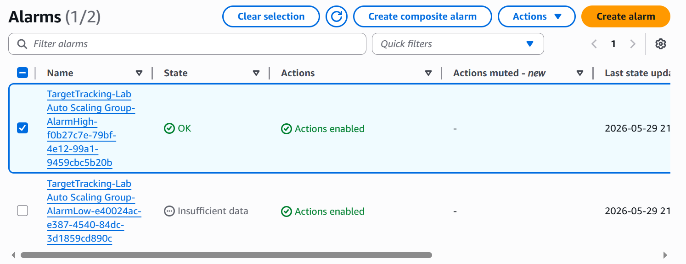

---

## Generate CPU Load

I returned to the web application and selected:

```text
Load Test
```

This generated CPU-intensive traffic across the Auto Scaling instances.

---

## Verify Scaling Activity

After several minutes, I verified that:

```text
AlarmHigh
```

entered the:

```text
In alarm
```

state.

I navigated to:

```text
Services → EC2 → Instances
```

and verified that additional instances were automatically launched.

### Result

The Auto Scaling group successfully scaled out based on CPU utilization.

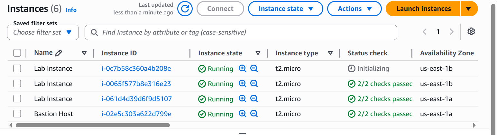

---

# Task 6: Terminate Web Server 1

Since the original server was no longer required after creating the AMI, I terminated it.

In the AWS Management Console, I navigated to:

```text
Services → EC2 → Instances
```

I selected:

```text
Web Server 1
```

and chose:

```text
Instance state → Terminate instance
```

I confirmed the termination.

### Result

The original EC2 instance was terminated successfully.

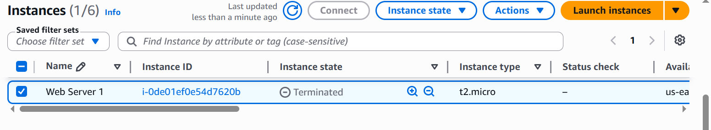

---

# Complete Architecture


| Component          | Configuration             |
| ------------------ | ------------------------- |
| Load Balancer      | Application Load Balancer |
| Load Balancer Name | LabELB                    |
| Target Group       | LabGroup                  |
| Launch Template    | LabConfig                 |
| Auto Scaling Group | Lab Auto Scaling Group    |
| Instance Type      | t2.micro                  |
| Desired Capacity   | 2                         |
| Minimum Capacity   | 2                         |
| Maximum Capacity   | 6                         |
| Scaling Policy     | Target Tracking           |
| CPU Threshold      | 60%                       |
| Monitoring         | Amazon CloudWatch         |
| Security Group     | Web Security Group        |

---

# Lessons Learned

| Concept                | Description                                                   |
| ---------------------- | ------------------------------------------------------------- |
| AMI                    | Amazon Machine Image used to launch identical EC2 instances   |
| Elastic Load Balancing | Distributes incoming traffic across multiple EC2 instances    |
| Target Group           | Collection of EC2 instances receiving load balancer traffic   |
| Auto Scaling           | Automatically adjusts EC2 capacity based on demand            |
| Launch Template        | Defines configuration used to launch EC2 instances            |
| CloudWatch Alarms      | Monitor metrics and trigger scaling actions                   |
| High Availability      | Infrastructure distributed across multiple Availability Zones |
| Fault Tolerance        | Load balancing improves application resilience                |
| Dynamic Scaling        | Automatically increases or decreases compute resources        |

---

# Repository Structure

```text
.
├── README.md
└── images/
    ├── starting-architecture.PNG
    ├── final-architecture.PNG
    ├── AMI-creation-configuration.PNG
    ├── target-group-created.PNG
    ├── load-balancer-created.PNG
    ├── launch-template-created.PNG
    ├── Auto-Scaling-group-created.PNG
    ├── Auto-Scaling-launched-instances.PNG
    ├── healthy-target-instances.PNG
    ├── application-accessed-through-load-balancer.PNG
    ├── CloudWatch-alarms.PNG
    ├── additional-instances-launched.PNG
    ├── Web-Server-1-terminated.PNG
    └── complete-architecture.PNG
```

---

*End of Lab 6 Writeup* 🚀
