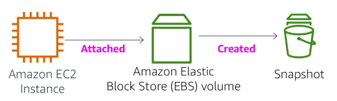
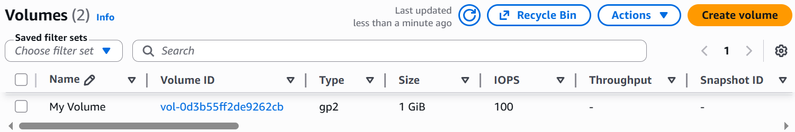
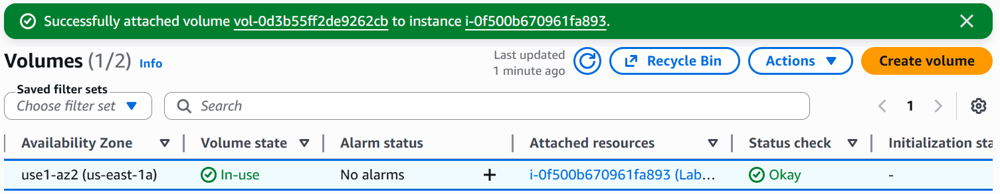
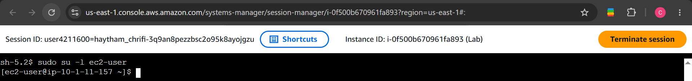
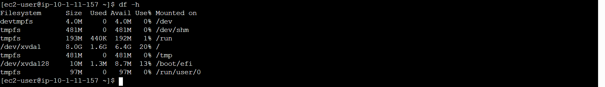
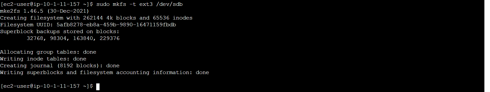
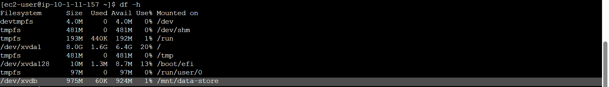
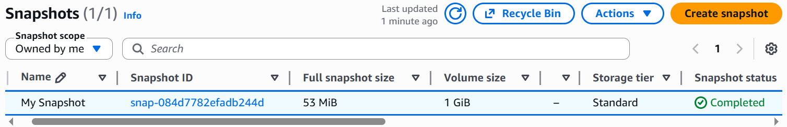
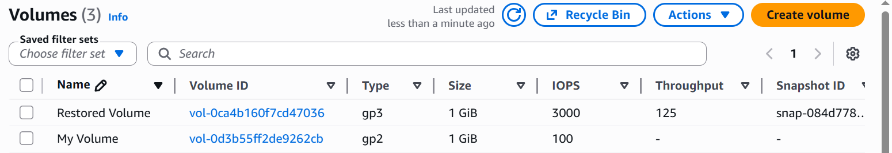
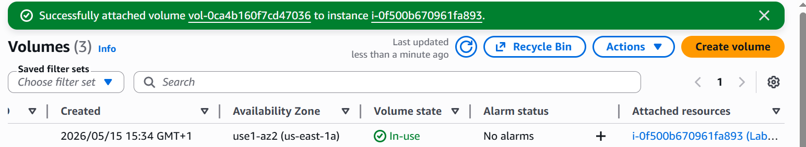

# Lab 4: Working with Amazon EBS

## Overview

This lab focuses on using Amazon Elastic Block Store (Amazon EBS) with Amazon EC2 instances. The objective is to create, attach, configure, back up, and restore EBS volumes in AWS.

## Objectives

- Create an Amazon EBS volume
- Attach and mount the volume to an EC2 instance
- Configure a Linux file system
- Create an EBS snapshot
- Restore data from a snapshot
- Verify persistent storage functionality

---

## Architecture Diagram



---

## Introduction to Amazon EBS

Amazon Elastic Block Store (Amazon EBS) provides persistent block-level storage for Amazon EC2 instances. EBS volumes can be attached to running instances and used like physical hard drives. Unlike instance store volumes, EBS volumes persist independently from the EC2 instance lifecycle.

Amazon EBS supports:

- Persistent storage
- Snapshot backups
- High durability and availability
- Flexible volume sizes
- Fast performance for cloud applications

Snapshots are stored in Amazon S3 and can be used to create new volumes for backup or recovery purposes.

---

# Task 1: Create a New EBS Volume

In this task, a new EBS volume was created and prepared for attachment to the EC2 instance.

## Steps Performed

1. Opened the AWS Management Console.
2. Navigated to:

```text
EC2 → Volumes → Create Volume
```

3. Configured the following settings:

- **Volume Type:** General Purpose SSD (gp2)
- **Size:** 1 GiB
- **Availability Zone:** Same as the EC2 instance

4. Added the following tag:

| Key | Value |
|---|---|
| Name | My Volume |

5. Created the volume.

## Result

The volume was successfully created and its state changed from **Creating** to **Available**.



---

# Task 2: Attach the Volume to the EC2 Instance

The newly created volume was attached to the running EC2 instance.

## Steps Performed

1. Selected `My Volume`.
2. Chose:

```text
Actions → Attach Volume
```

3. Selected the EC2 instance named `Lab`.
4. Selected the following device name:

```bash
/dev/sdb
```

5. Attached the volume.

## Result

The volume state changed to **In-use**, confirming successful attachment.



---

# Task 3: Connect to the EC2 Instance

The EC2 instance was accessed using AWS Systems Manager Session Manager.

## Steps Performed

1. Navigated to:

```text
EC2 → Instances
```

2. Selected the `Lab` instance.
3. Chose:

```text
Connect → Session Manager → Connect
```

4. Switched to the `ec2-user` account.

## Command Used

```bash
sudo su -l ec2-user
```



---

# Task 4: Create and Configure the File System

The attached EBS volume was formatted and mounted to the Linux instance.

## Step 1: Verify Existing Storage

### Command

```bash
df -h
```

### Purpose

Displays currently mounted file systems and available storage.

### Example Output

```bash
Filesystem      Size  Used Avail Use% Mounted on
/dev/xvda1      8.0G  1.5G  6.6G  19% /
```



---

## Step 2: Create an EXT3 File System

### Command

```bash
sudo mkfs -t ext3 /dev/sdb
```

### Purpose

Formats the attached EBS volume with the EXT3 file system.



---

## Step 3: Create a Mount Directory

### Command

```bash
sudo mkdir /mnt/data-store
```

### Purpose

Creates a directory used to mount the EBS volume.

---

## Step 4: Mount the Volume

### Command

```bash
sudo mount /dev/sdb /mnt/data-store
```

### Purpose

Mounts the EBS volume to the Linux file system.

---

## Step 5: Configure Automatic Mounting

### Command

```bash
echo "/dev/sdb /mnt/data-store ext3 defaults,noatime 1 2" | sudo tee -a /etc/fstab
```

### Purpose

Ensures the volume automatically mounts after a reboot.

---

## Step 6: Verify Configuration

### Command

```bash
cat /etc/fstab
```


---

## Step 7: Verify Mounted Storage

### Command

```bash
df -h
```

### Result

The new mounted volume appeared as:

```bash
/dev/xvdb
```



---

## Step 8: Create a File on the Mounted Volume

### Command

```bash
sudo sh -c "echo some text has been written > /mnt/data-store/file.txt"
```

### Purpose

Creates a test file on the EBS volume.

---

## Step 9: Verify the File

### Command

```bash
cat /mnt/data-store/file.txt
```

### Result

```text
some text has been written
```


---

# Task 5: Create an Amazon EBS Snapshot

An EBS snapshot was created to back up the data stored on the volume.

## Steps Performed

1. Opened:

```text
EC2 → Volumes
```

2. Selected `My Volume`.
3. Chose:

```text
Actions → Create Snapshot
```

4. Added the following tag:

| Key | Value |
|---|---|
| Name | My Snapshot |

5. Created the snapshot.

## Result

The snapshot status changed from **Pending** to **Completed**.



---

## Delete the Original File

### Command

```bash
sudo rm /mnt/data-store/file.txt
```

### Verify Deletion

```bash
ls /mnt/data-store/
```

### Result

The directory became empty.


---

# Task 6: Restore the Amazon EBS Snapshot

The snapshot was restored by creating a new EBS volume from it.

## Create a Volume from Snapshot

### Steps Performed

1. Opened:

```text
EC2 → Snapshots
```

2. Selected `My Snapshot`.
3. Chose:

```text
Create Volume from Snapshot
```

4. Selected the same Availability Zone.
5. Added the following tag:

| Key | Value |
|---|---|
| Name | Restored Volume |

6. Created the volume.



---

## Attach the Restored Volume

### Steps Performed

1. Opened:

```text
EC2 → Volumes
```

2. Selected `Restored Volume`.
3. Chose:

```text
Attach Volume
```

4. Selected the `Lab` instance.
5. Selected the following device name:

```bash
/dev/sdc
```

6. Attached the volume.



---

## Mount the Restored Volume

### Step 1: Create a Mount Directory

#### Command

```bash
sudo mkdir /mnt/data-store2
```

---

### Step 2: Mount the Restored Volume

#### Command

```bash
sudo mount /dev/sdc /mnt/data-store2
```

---

### Step 3: Verify Restored Data

#### Command

```bash
ls /mnt/data-store2/
```

### Result

```text
file.txt
```

This confirms that the snapshot successfully preserved and restored the data.


---

# Conclusion

In this lab, Amazon EBS storage management was successfully implemented using AWS EC2. The following tasks were completed:

- Created an Amazon EBS volume
- Attached the volume to an EC2 instance
- Configured and mounted a Linux file system
- Stored data on the EBS volume
- Created an EBS snapshot
- Restored the snapshot into a new volume
- Verified successful data recovery

This lab demonstrated the importance of Amazon EBS for persistent storage and backup management in AWS cloud environments.

---

# Repository Structure

```text
.
├── README.md
└── images/
    ├── architecture-diagram.png
    ├── attach-volume.png
    ├── create-volume.png
    ├── df-before.png
    ├── file-created.png
    ├── file-deleted.png
    ├── fstab.png
    ├── mkfs.png
    ├── mounted-volume.png
    ├── restored-file.png
    ├── restored-volume-attached.png
    ├── restored-volume.png
    ├── session-manager.png
    └── snapshot-created.png
```
