# Lab 3: Introduction to Amazon EC2

## 1. Overview

In this lab I launched, resized, managed, and monitored an Amazon EC2 instance. I launched a web server with termination protection enabled, monitored the instance using CloudWatch metrics and system logs, modified the security group to allow HTTP access, resized the instance to scale, explored EC2 limits, and tested stop protection.

Amazon Elastic Compute Cloud (Amazon EC2) is a web service that provides resizable compute capacity in the cloud. It is designed to make web-scale cloud computing easier for developers. Amazon EC2 provides complete control of computing resources and reduces the time required to obtain and boot new server instances to minutes, allowing you to quickly scale capacity as your computing requirements change.

After completing this lab, I was able to:

- Launch a web server with termination protection enabled
- Monitor an EC2 instance
- Modify the security group to allow HTTP access
- Resize an Amazon EC2 instance to scale and enable stop protection
- Explore EC2 limits
- Test stop protection
- Stop an EC2 instance

## 2. Architecture

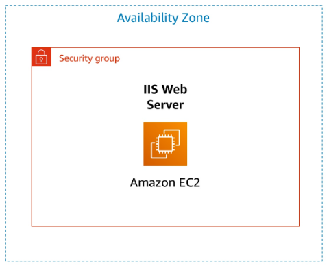

## 3. Tasks Performed

### 3.1 Launch Amazon EC2 Instance

In the AWS Management Console, I chose **Services**, then **Compute**, then **EC2**.

I verified that **N. Virginia (us-east-1)** region was selected.

From the **Launch instance** menu, I selected **Launch instance**.

**Step 1: Name and tags**

| Configuration Setting | Value |
|----------------------|-------|
| Name | Web Server |

**Step 2: Application and OS Images (AMI)**

| Configuration Setting | Value |
|----------------------|-------|
| AMI | Amazon Linux 2023 (default) |

**Step 3: Instance type**

| Configuration Setting | Value |
|----------------------|-------|
| Instance type | t2.micro |

**Step 4: Key pair**

| Configuration Setting | Value |
|----------------------|-------|
| Key pair name | vockey |

**Step 5: Network settings**

| Configuration Setting | Value |
|----------------------|-------|
| VPC | Lab VPC |
| Subnet | PublicSubnet1 |
| Auto-assign public IP | Enable |
| Firewall (security groups) | Create new: Web Server security group |
| Description | Security group for my web server |

I removed the default inbound rule.

**Step 6: Configure storage**

| Configuration Setting | Value |
|----------------------|-------|
| Root volume size | 8 GiB (default) |

**Step 7: Advanced details**

| Configuration Setting | Value |
|----------------------|-------|
| Termination protection | Enable |

I scrolled to the bottom and pasted the following script into the **User data** box:

```
#!/bin/bash
dnf install -y httpd
systemctl enable httpd
systemctl start httpd
echo '<html><h1>Hello From Your Web Server!</h1></html>' > /var/www/html/index.html
```

**Step 8: Launch the instance**

At the bottom of the Summary panel, I chose **Launch instance**.

I saw a Success message and chose **View all instances**.

I selected **Web Server** and reviewed the information in the Details tab.

I waited until the instance displayed:

| Status | Value |
|--------|-------|
| Instance State | Running |
| Status Checks | 2/2 checks passed |

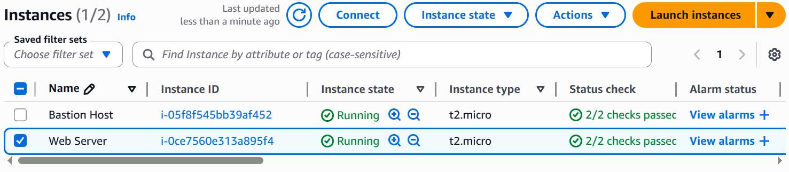

### 3.2 Monitor Your Instance

I selected the **Web Server** instance and explored the monitoring features.

**Status Checks tab:**

I chose the **Status checks** tab and noticed that both checks passed:

| Check | Status |
|-------|--------|
| System reachability | Passed |
| Instance reachability | Passed |

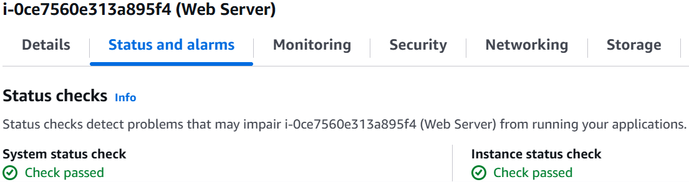

**Monitoring tab:**

I chose the **Monitoring** tab to view Amazon CloudWatch metrics for my instance.

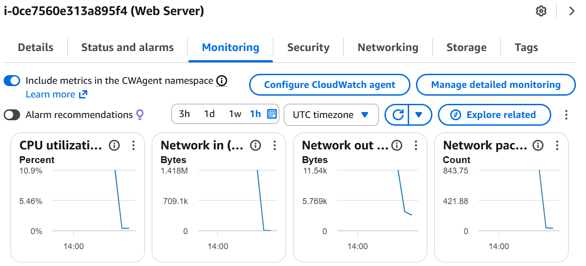

**Get system log:**

From the **Actions** menu, I selected **Monitor and troubleshoot** → **Get system log**.

I scrolled through the output and noted that the HTTP package was installed from the user data.

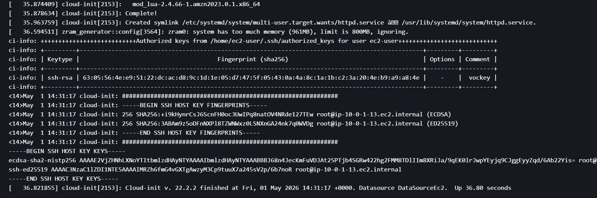

I clicked **Cancel**.

**Get instance screenshot:**

From the **Actions** menu, I selected **Monitor and troubleshoot** → **Get instance screenshot**.

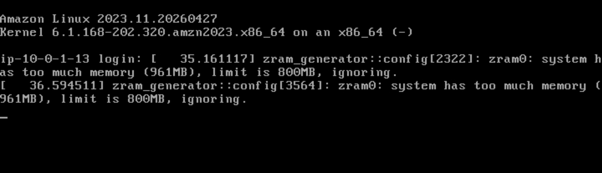

I clicked **Cancel**.

### 3.3 Update Security Group and Access the Web Server

**Test web server access (before fixing security group):**

I selected **Web Server** and copied the **Public IPv4 address** from the Details tab.

I opened a new browser tab, pasted the IP address, and pressed Enter.

**Result:** I was not able to access the web server because the security group was not permitting inbound traffic on port 80.

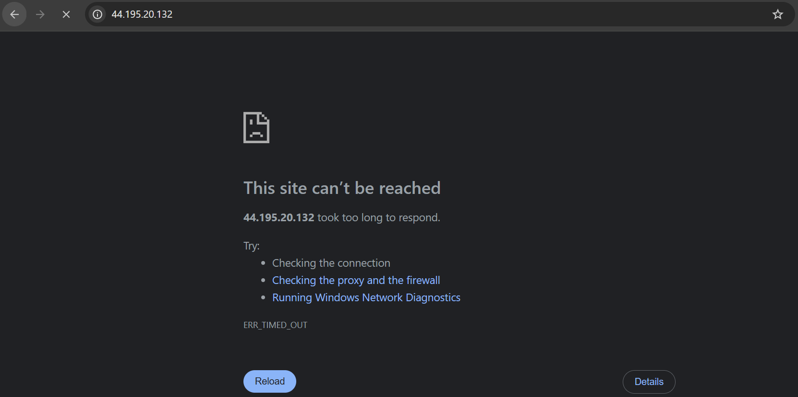

**Update security group:**

In the left navigation pane, I chose **Security Groups**.

I selected **Web Server security group**.

I chose the **Inbound rules** tab. The security group had no inbound rules.

I chose **Edit inbound rules**, then **Add rule** and configured:

| Type | Source |
|------|--------|
| HTTP | Anywhere-IPv4 (0.0.0.0/0) |

I chose **Save rules**.

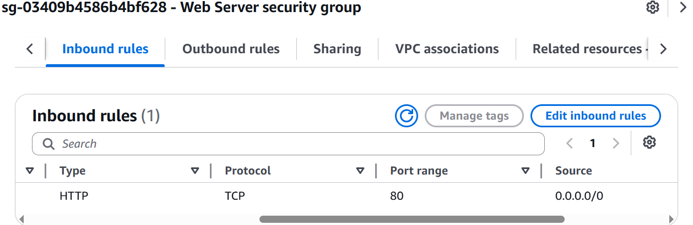

**Test web server access (after fixing security group):**

I returned to the web browser tab and refreshed the page.

**Result:** I saw the message "Hello From Your Web Server!"

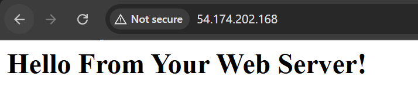

### 3.4 Resize Your Instance

**Stop the instance:**

In the left navigation pane, I chose **Instances** and selected **Web Server**.

From the **Instance state** menu, I selected **Stop instance**, then chose **Stop**.

I waited until the Instance state displayed **Stopped**.

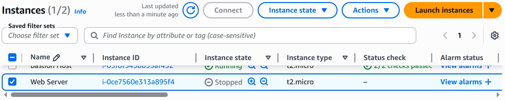

**Change the instance type and enable stop protection:**

I selected **Web Server**, then from the **Actions** menu selected **Instance settings** → **Change instance type** and configured:

| Configuration Setting | Value |
|----------------------|-------|
| Instance Type | t2.small |

I chose **Apply**.

I selected **Web Server**, then from the **Actions** menu selected **Instance settings** → **Change stop protection**. I selected **Enable** and saved the change.

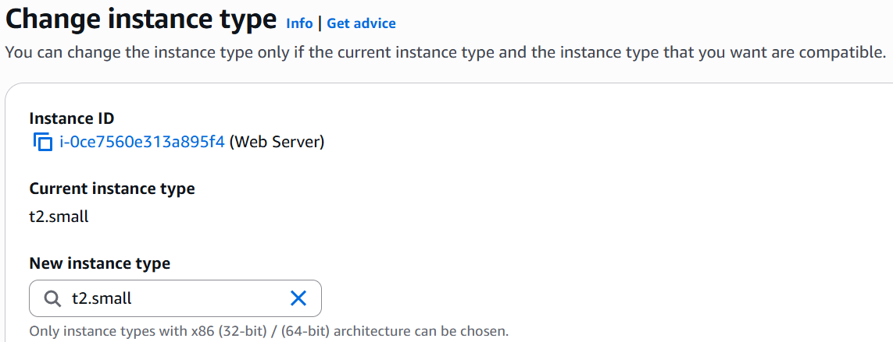

**Resize the EBS Volume:**

With **Web Server** still selected, I chose the **Storage** tab, selected the Volume ID, and checked the checkbox next to the volume.

From the **Actions** menu, I selected **Modify volume** and changed:

| Configuration Setting | Value |
|----------------------|-------|
| Size | 10 GiB |

I chose **Modify**, then **Modify** again to confirm.

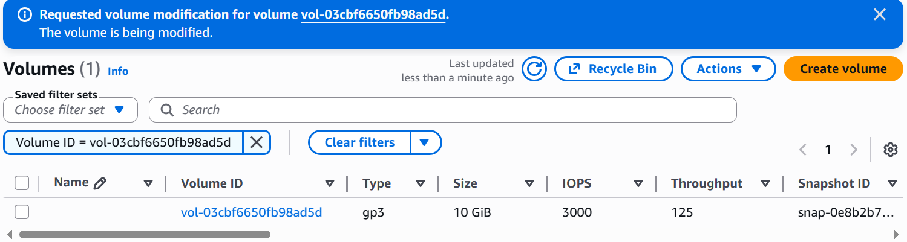

**Start the resized instance:**

From the **Instance state** menu, I selected **Start instance**.

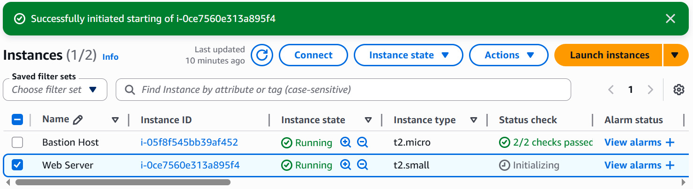

### 3.5 Explore EC2 Limits

In the AWS Management Console, I searched for and chose **Service Quotas**.

I chose **AWS services** from the navigation menu and searched for `ec2`, then selected **Amazon Elastic Compute Cloud (Amazon EC2)**.

In the **Find quotas** search bar, I searched for `running on-demand` and observed the filtered list of service quotas.

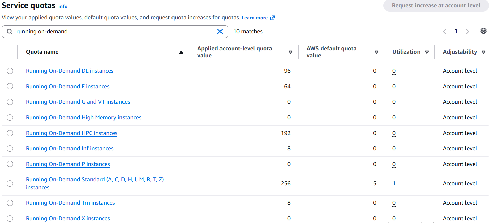

### 3.6 Test Stop Protection

I returned to the EC2 console and selected **Web Server**.

From the **Instance state** menu, I selected **Stop instance**, then chose **Stop**.

**Result:** I saw a message: "Failed to stop the instance... The instance may not be stopped." This showed that stop protection was working.

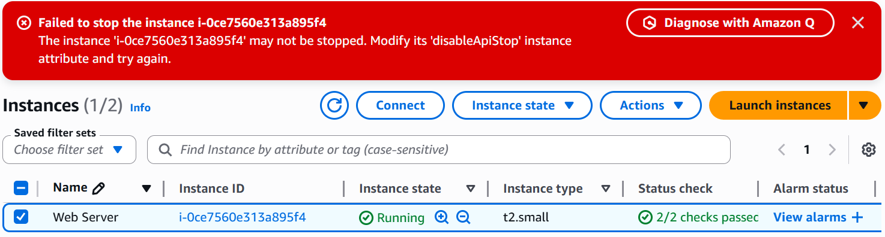

**Disable stop protection:**

From the **Actions** menu, I selected **Instance settings** → **Change stop protection**.

I removed the check next to **Enable** and chose **Save**.

**Stop the instance:**

I selected **Web Server** again and from the **Instance state** menu selected **Stop instance**, then chose **Stop**.

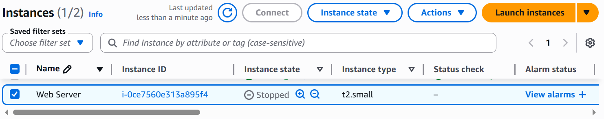

## 4. Complete Architecture

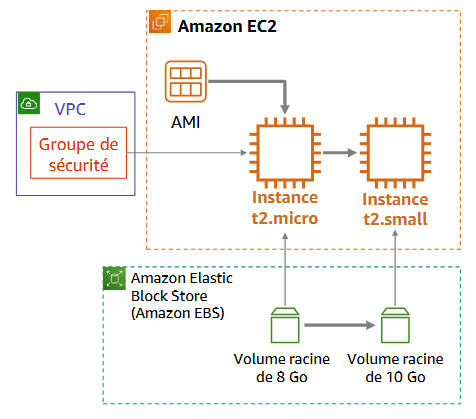

| Component | Configuration |
|-----------|--------------|
| EC2 Instance Name | Web Server |
| AMI | Amazon Linux 2023 |
| Instance Type | t2.micro (resized to t2.small) |
| Key Pair | vockey |
| VPC | Lab VPC |
| Subnet | PublicSubnet1 |
| Security Group | Web Server security group (HTTP from 0.0.0.0/0) |
| Root Volume | 8 GiB (resized to 10 GiB) |
| Termination Protection | Enabled |
| Stop Protection | Enabled then disabled |
| User Data | Installed Apache and created web page |

## 5. Lessons Learned

| Concept | What I Learned |
|---------|----------------|
| Amazon EC2 | A web service that provides resizable compute capacity in the cloud |
| AMI | Amazon Machine Image provides the template for the root volume of an instance |
| Instance Type | Defines CPU, memory, storage, and networking capacity (t2.micro = 1 vCPU, 1 GiB RAM) |
| Key Pair | Used for public-key cryptography to encrypt and decrypt login information |
| Security Group | Acts as a virtual firewall controlling traffic to instances |
| User Data | Scripts that run automatically on first boot with root permissions |
| Termination Protection | Prevents accidental termination of an EC2 instance |
| Stop Protection | Prevents accidental stopping of an EC2 instance |
| Status Checks | Amazon EC2 performs automated checks to identify hardware and software issues |
| CloudWatch Metrics | Amazon EC2 sends metrics to CloudWatch for monitoring |
| System Log | Console output of the instance for problem diagnosis |
| Instance Screenshot | Captures what the instance console would look like |
| Service Quotas | Default limits on resources per region (e.g., running On-Demand instances) |
| EBS Volume | Can be modified to increase size while stopped |

## 6. References

- [Launch Your Instance](https://docs.aws.amazon.com/AWSEC2/latest/UserGuide/LaunchingAndUsingInstances.html)
- [Amazon EC2 Instance Types](https://aws.amazon.com/ec2/instance-types/)
- [Amazon Machine Images (AMI)](https://docs.aws.amazon.com/AWSEC2/latest/UserGuide/AMIs.html)
- [User Data and Shell Scripts](https://docs.aws.amazon.com/AWSEC2/latest/UserGuide/user-data.html)
- [Security Groups](https://docs.aws.amazon.com/vpc/latest/userguide/VPC_SecurityGroups.html)
- [Status Checks for Your Instances](https://docs.aws.amazon.com/AWSEC2/latest/UserGuide/monitoring-system-instance-status-check.html)
- [Resizing Your Instance](https://docs.aws.amazon.com/AWSEC2/latest/UserGuide/ec2-instance-resize.html)
- [Stop and Start Your Instance](https://docs.aws.amazon.com/AWSEC2/latest/UserGuide/Stop_Start.html)
- [Amazon EC2 Service Limits](https://docs.aws.amazon.com/AWSEC2/latest/UserGuide/ec2-resource-limits.html)
- [Termination Protection for an Instance](https://docs.aws.amazon.com/AWSEC2/latest/UserGuide/terminating-instances.html#termination-protection)

---

*End of Lab 3 Writeup* 🚀
