# Lab 1 – Introduction to AWS IAM

## 1. Overview

In this lab I explored AWS Identity and Access Management (IAM) by working with pre‑created IAM users and groups. I inspected their permissions, attached managed and inline policies, and then tested how those permissions affected access to Amazon S3 and Amazon EC2.

## 2. Objectives

By the end of the lab I was able to:

- Explore existing IAM **Users** and **User groups**.
- Understand the difference between **managed policies** and **inline policies**.
- Assign users to groups based on a simple business scenario.
- Use the **IAM sign‑in URL** to log in as different IAM users.
- Test how IAM policies control access to **S3** and **EC2**.

## 3. Lab Environment

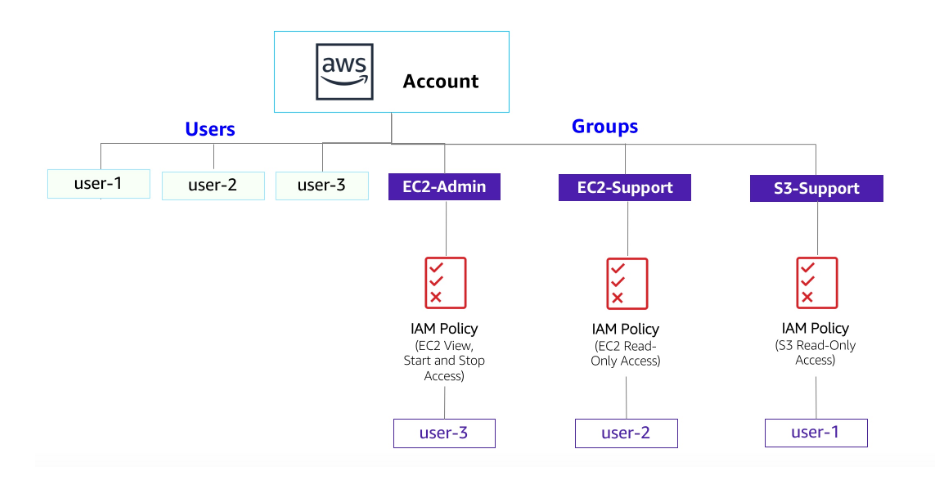

- Pre‑created IAM users: `user-1`, `user-2`, `user-3`
- Pre‑created IAM groups:
  - `S3-Support` – Amazon S3 read‑only
  - `EC2-Support` – Amazon EC2 read‑only
  - `EC2-Admin` – Amazon EC2 view, start, and stop
- Limited permissions: only lab‑relevant services/actions are allowed; other actions can show “not authorized” errors.

## 4. Business Scenario

The company is expanding its use of AWS and wants to grant access according to job function:

| User   | Group       | Permissions                                  |
|--------|-------------|----------------------------------------------|
| user-1 | S3-Support  | Read‑only access to Amazon S3               |
| user-2 | EC2-Support | Read‑only access to Amazon EC2              |
| user-3 | EC2-Admin   | View, Start, and Stop Amazon EC2 instances  |

The rest of the lab implements and tests this scenario.

---

## 5. Task 1 – Explore the Users and Groups

### 5.1 Inspect IAM Users

1. In the console, searched for **IAM** and opened the **IAM** service.
2. In the left navigation pane, chose **Users**.
3. Confirmed the following users existed: `user-1`, `user-2`, `user-3`.

  
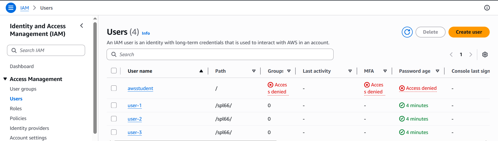

4. Chose **user-1** to open the user summary page.
   - On the **Permissions** tab, user‑1 had **no permissions** attached.
   - On the **Groups** tab, user‑1 was **not a member of any groups**.
   - On the **Security credentials** tab, user‑1 had a **console password** configured.


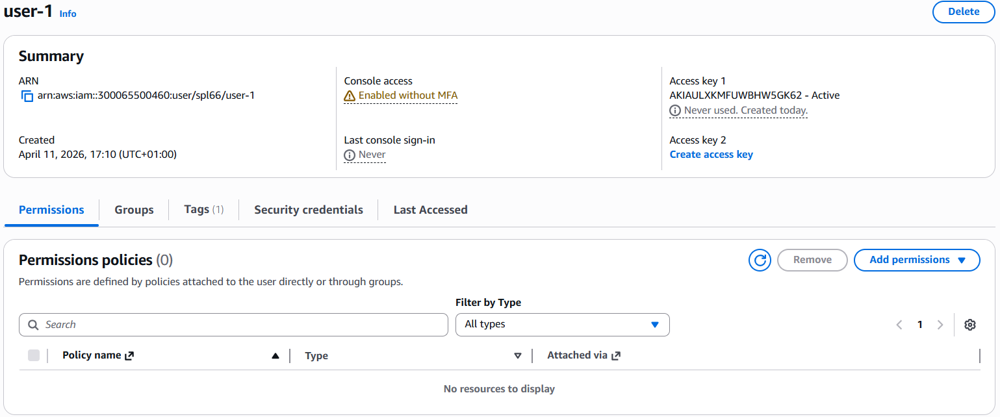

### 5.2 Inspect IAM Groups and Policies

1. In the left navigation pane, chose **User groups**.
2. Verified the following groups existed:

   - `EC2-Admin`
   - `EC2-Support`
   - `S3-Support`

 
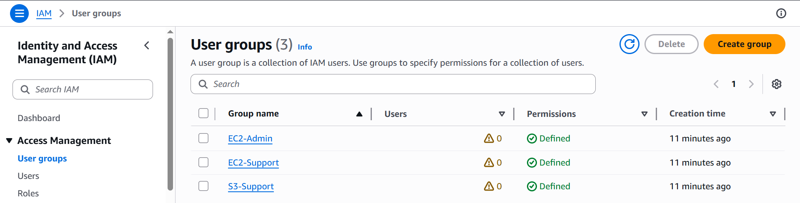

#### 5.2.1 EC2-Support Group (Managed Policy)

1. Opened the **EC2-Support** group and went to the **Permissions** tab.
2. Observed the **managed policy** `AmazonEC2ReadOnlyAccess` attached.
3. Expanded the policy (plus icon) to view details.

Key observations:

- The policy allows **List** and **Describe** actions for:
  - Amazon EC2
  - Elastic Load Balancing
  - CloudWatch
  - Auto Scaling
- This makes it ideal for a **support** role that needs visibility but no modification rights.

 
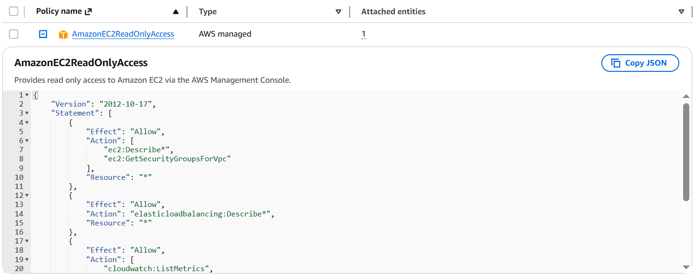

I also reviewed the basic IAM policy structure:

- **Effect** – `Allow` or `Deny`.
- **Action** – specific API calls (for example, `ec2:DescribeInstances`).
- **Resource** – which resources the rule applies to (specific ARNs or `*`).

```json
  {
    "Version": "2012-10-17",
    "Statement": [
        {
            "Effect": "Allow",
            "Action": [
                "ec2:Describe*",
                "ec2:GetSecurityGroupsForVpc"
            ],
            "Resource": "*"
        },
        {
            "Effect": "Allow",
            "Action": "elasticloadbalancing:Describe*",
            "Resource": "*"
        },
        {
            "Effect": "Allow",
            "Action": [
                "cloudwatch:ListMetrics",
                "cloudwatch:GetMetricStatistics",
                "cloudwatch:Describe*"
            ],
            "Resource": "*"
        },
        {
            "Effect": "Allow",
            "Action": "autoscaling:Describe*",
            "Resource": "*"
        }
    ]
}
```

#### 5.2.2 S3-Support Group (Managed Policy)

1. Opened the **S3-Support** group → **Permissions** tab.
2. Saw the managed policy **`AmazonS3ReadOnlyAccess`** attached.
3. Expanded the policy to view details.

Key observations:

- Grants **Get** and **List** permissions on S3.
- Enables viewing buckets and objects without making changes.


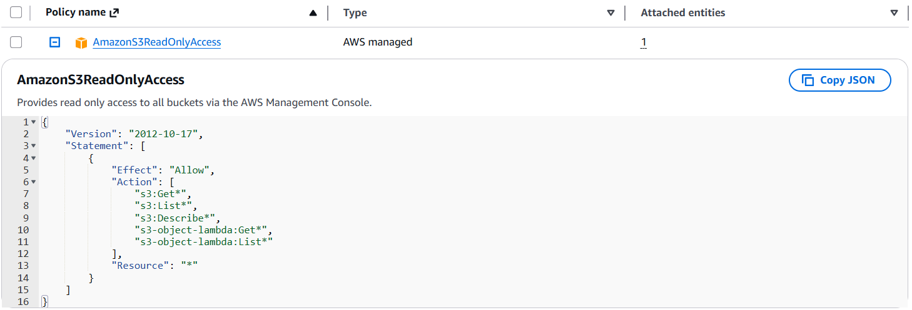

#### 5.2.3 EC2-Admin Group (Inline Policy)

1. Opened the **EC2-Admin** group → **Permissions** tab.
2. Noted that instead of a managed policy, this group uses an **inline policy**.
3. Expanded the inline policy.

Key observations:

- Allows **Describe** actions (viewing EC2 information).
- Also allows **Start** and **Stop** instance actions.
- Inline policies are attached to exactly one user or group and are often used for **one‑off** permissions.


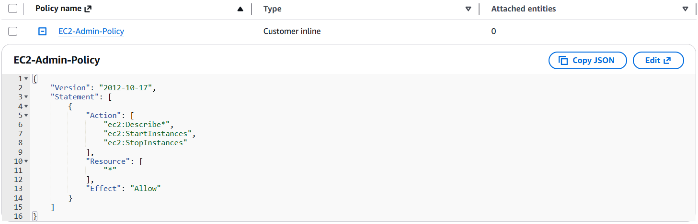

---

## 6. Task 2 – Add Users to Groups

The goal is to enforce the business scenario by mapping each user to the correct group.

> Note: Some “not authorized” errors are expected due to the lab restrictions. They did not prevent completing the steps.

### 6.1 Add user‑1 to S3-Support

1. In **User groups**, opened **S3-Support**.
2. Went to the **Users** tab and chose **Add users**.
3. Selected `user-1` and chose **Add users**.

Result: `user-1` now appears as a member of the **S3-Support** group and inherits `AmazonS3ReadOnlyAccess`.


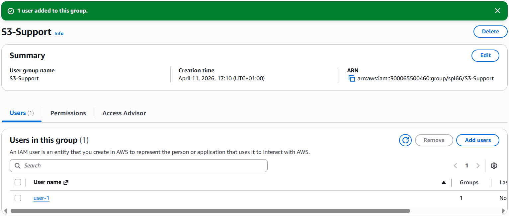

### 6.2 Add user‑2 to EC2-Support

1. From **User groups**, opened **EC2-Support**.
2. On the **Users** tab, selected **Add users**.
3. Added `user-2`.

Result: `user-2` now has **EC2 read‑only** permissions.

 
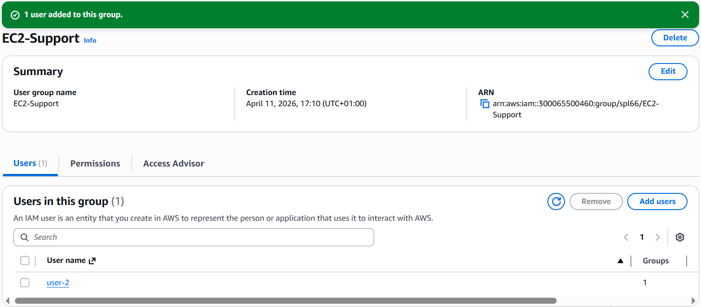

### 6.3 Add user‑3 to EC2-Admin

1. From **User groups**, opened **EC2-Admin**.
2. On the **Users** tab, added `user-3`.

Result: `user-3` now has **EC2 admin** permissions (view, start, stop instances).


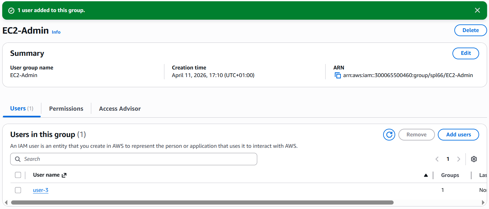

### 6.4 Verify Group Membership

Back on the **User groups** page each group now showed **1** in the **Users** column, matching:

- `S3-Support` → `user-1`
- `EC2-Support` → `user-2`
- `EC2-Admin` → `user-3`

---

## 7. Task 3 – Sign In as Each User and Test Permissions

### 7.1 Get the IAM Sign‑In URL

1. In IAM, opened the **Dashboard**.
2. Copied the **“Sign-in URL for IAM users in this account”** (format:  
   `https://123456789012.signin.aws.amazon.com/console`).
3. Pasted it into a text editor for reuse.

 
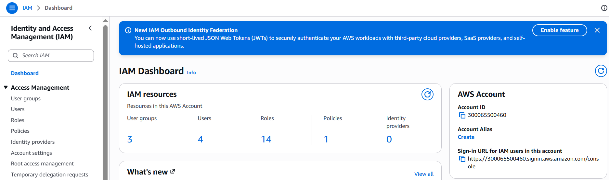

Opened a **private / incognito** browser window for the following tests.

---

### 7.2 Test user‑1 (S3 read‑only)

**Sign in as user‑1**

- Used the IAM sign‑in URL.
- IAM user name: `user-1`  
  Password: `Lab-Password1`

**Test S3 access**

1. Searched for **S3** and opened the **S3** console.
2. Selected the existing bucket and browsed its contents.

Result:

- `user-1` could **list buckets** and **view contents**.
- The bucket was empty, but listing worked, confirming **S3 read‑only**.

 
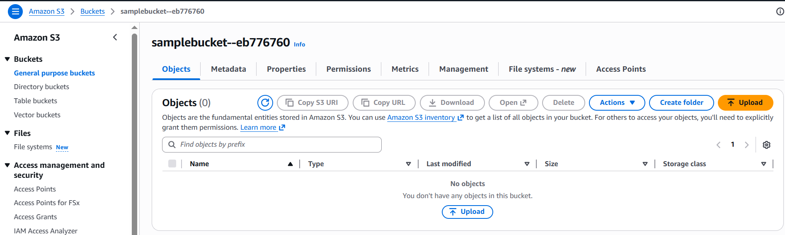

**Test EC2 access**

1. Searched for **EC2** and opened the **EC2** console.
2. Chose **Instances**.

Result:

- Saw an error: **“You are not authorized to perform this operation.”**
- `user-1` has **no EC2 permissions**, which matches the scenario.

 
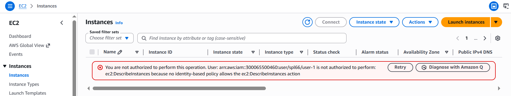

Signed out as `user-1` from the console.

---

### 7.3 Test user‑2 (EC2 read‑only)

**Sign in as user‑2**

- Used the same IAM sign‑in URL.
- IAM user name: `user-2`  
  Password: `Lab-Password2`

**Test EC2 read‑only**

1. Opened the **EC2** console.
2. Verified the correct **Region** (for example, N. Virginia).
3. Went to **Instances** and saw the instance named **LabHost**.
4. Tried to stop the instance:  
   **Instance state → Stop instance → Stop**.

Result:

- Received an error: **“You are not authorized to perform this operation.”**
- Confirms that `user-2` can **view** EC2 instances but **cannot modify** them.

 
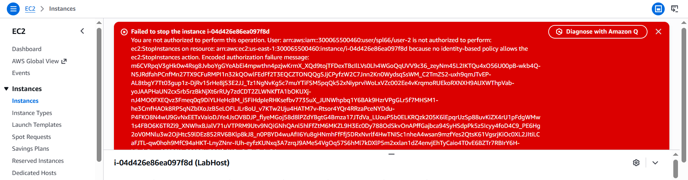

**Test S3 access**

- Opened the **S3** console.

Result:

- Saw **“You don't have permissions to list buckets”**.
- Confirms that `user-2` has **no S3 permissions**.

 
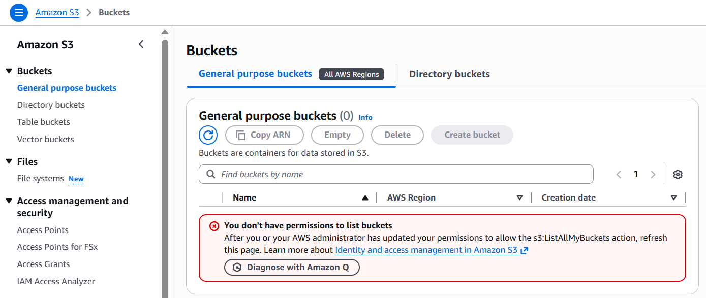

Signed out as `user-2`.

---

### 7.4 Test user‑3 (EC2 admin)

**Sign in as user‑3**

- IAM user name: `user-3`  
  Password: `Lab-Password3`

**Test EC2 admin actions**

1. Opened the **EC2** console and navigated to **Instances**.
2. Selected the **LabHost** instance.
3. Chose **Instance state → Stop instance → Stop**.

Result:

- The instance entered the **stopping** state and then shut down successfully.
- Confirms that `user-3` has **admin‑level EC2 permissions** (Describe, Start, Stop).

  
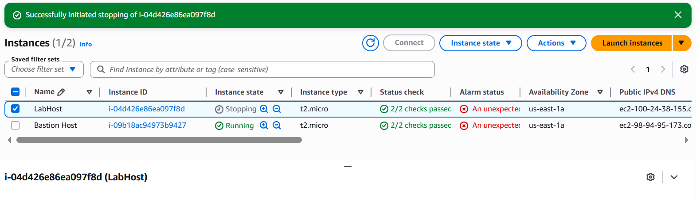

Closed the private browser window after finishing the tests.

---

## 8. Issues & Troubleshooting

- Some “not authorized” errors appeared when trying actions outside the allowed permissions; these were expected and confirmed the policies were working correctly.
- When I couldn’t see the **LabHost** instance, the issue was the wrong **Region** selected. Switching back to the correct region fixed it.

---

## 9. Key Takeaways

- IAM **users** get permissions through **policies**, usually attached via **groups**.
- **Managed policies** (like `AmazonEC2ReadOnlyAccess` and `AmazonS3ReadOnlyAccess`) are reusable and easy to maintain.
- **Inline policies** are tied to a single user or group and are useful for special‑case permissions (such as `EC2-Admin`).
- The combination of users and groups in this lab clearly illustrates **least privilege**:
  - `user-1`: S3 read‑only, no EC2.
  - `user-2`: EC2 read‑only, no S3.
  - `user-3`: EC2 admin abilities.
- Always double‑check the **Region** when you “can’t see” resources.

## 10. References

- AWS Docs – IAM: Users, Groups, and Policies  
- AWS Docs – AmazonEC2ReadOnlyAccess & AmazonS3ReadOnlyAccess policies  
- AWS Docs – IAM Best Practices
