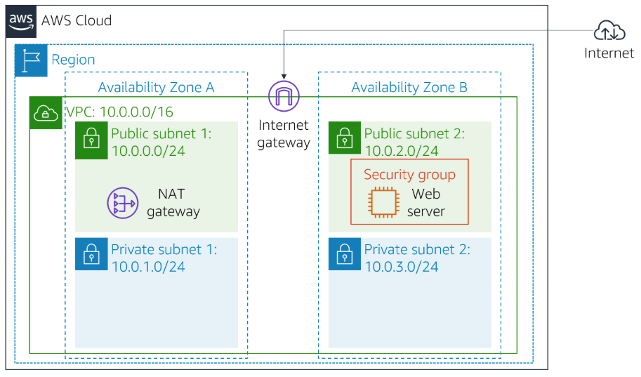
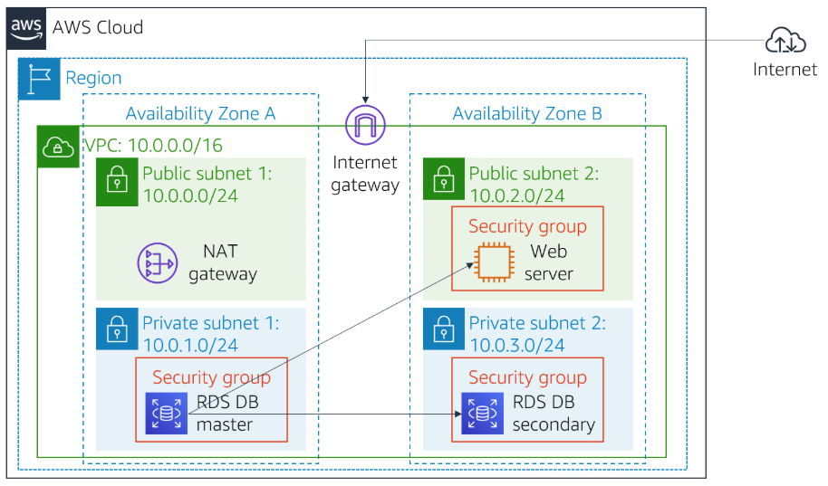
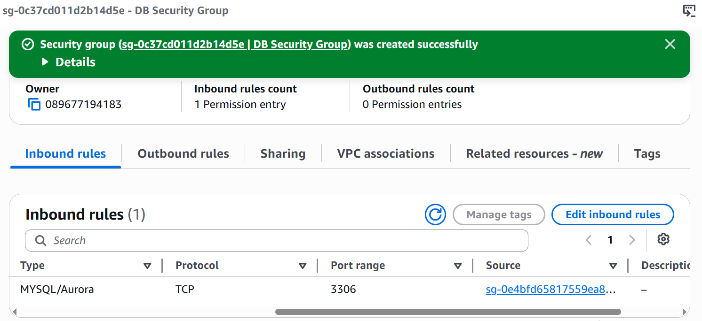
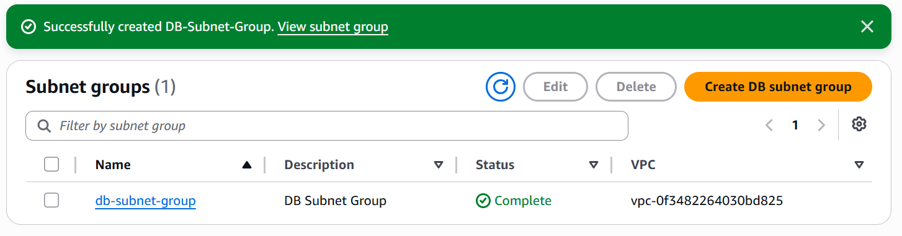
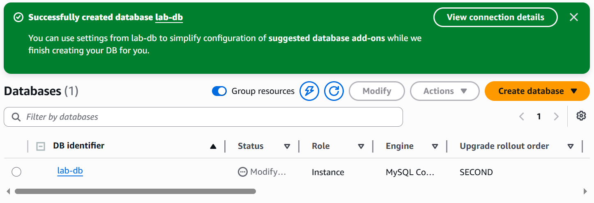
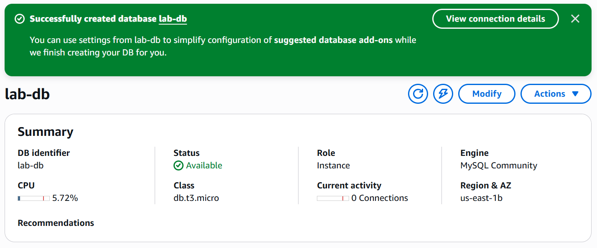
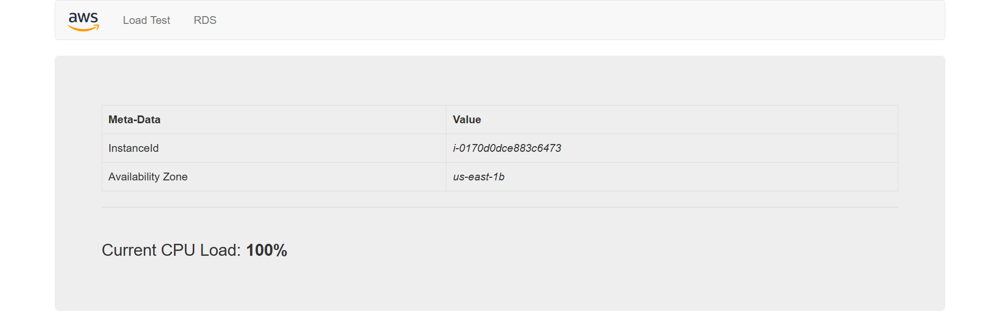
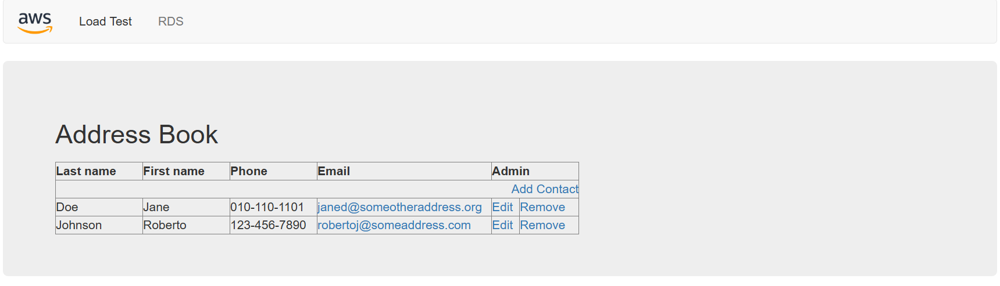

# Lab 5: Build Your DB Server and Interact With Your DB Using an App

## Overview

In this lab, I deployed and configured an Amazon Relational Database Service (Amazon RDS) MySQL database instance and connected it to a web application running on an Amazon EC2 instance. I created a custom security group, configured a DB subnet group, launched a Multi-AZ RDS database instance, and tested database connectivity through a web-based address book application.

Amazon Relational Database Service (Amazon RDS) is a managed database service that simplifies the setup, operation, and scaling of relational databases in AWS. Amazon RDS automates administrative tasks such as backups, patching, monitoring, and high availability, allowing developers to focus on applications instead of infrastructure management.

After completing this lab, I was able to:

- Create a security group for an RDS database
- Configure a DB subnet group
- Launch a Multi-AZ Amazon RDS MySQL database instance
- Configure database connectivity between EC2 and RDS
- Connect a web application to an RDS database
- Interact with data stored in the database

---

# Architecture Diagram



---

# Final Architecture



---

# Task 1: Create a Security Group for the RDS DB Instance

In the AWS Management Console, I navigated to:

```text
Services → VPC → Security Groups
```

I selected:

```text
Create security group
```

and configured the following settings:

| Configuration Setting | Value |
|---|---|
| Security group name | DB Security Group |
| Description | Permit access from Web Security Group |
| VPC | Lab VPC |

---

## Configure Inbound Rules

I added the following inbound rule:

| Type | Source |
|---|---|
| MySQL/Aurora (3306) | Web Security Group |

This rule allows inbound MySQL traffic from EC2 instances associated with the `Web Security Group`.

I selected:

```text
Create security group
```

### Result

The security group was successfully created.



---

# Task 2: Create a DB Subnet Group

In the AWS Management Console, I navigated to:

```text
Services → RDS → Subnet groups
```

I selected:

```text
Create DB Subnet Group
```

and configured the following settings:

| Configuration Setting | Value |
|---|---|
| Name | DB-Subnet-Group |
| Description | DB Subnet Group |
| VPC | Lab VPC |

---

## Configure Availability Zones and Subnets

I selected the following Availability Zones:

```text
us-east-1a
us-east-1b
```

I selected the following subnets:

| CIDR Range |
|---|
| 10.0.1.0/24 |
| 10.0.3.0/24 |

I selected:

```text
Create
```

### Result

The DB subnet group was successfully created.



---

# Task 3: Create an Amazon RDS DB Instance

In the AWS Management Console, I navigated to:

```text
Services → RDS → Databases
```

I selected:

```text
Create database
```

---

## Configure Engine Options

I selected the following database engine:

| Configuration Setting | Value |
|---|---|
| Engine type | MySQL |

---

## Configure Template and Availability

| Configuration Setting | Value |
|---|---|
| Template | Dev/Test |
| Availability and durability | Multi-AZ DB instance |

---

## Configure Database Settings

| Configuration Setting | Value |
|---|---|
| DB instance identifier | lab-db |
| Master username | main |
| Master password | lab-password |

---

## Configure Instance Class

| Configuration Setting | Value |
|---|---|
| DB instance class | db.t3.micro |

---

## Configure Storage

| Configuration Setting | Value |
|---|---|
| Storage type | General Purpose SSD |
| Allocated storage | 20 GiB |

---

## Configure Connectivity

| Configuration Setting | Value |
|---|---|
| VPC | Lab VPC |
| Security Group | DB Security Group |

I removed the default security group.

---

## Configure Additional Settings

| Configuration Setting | Value |
|---|---|
| Initial database name | lab |
| Enable automatic backups | Disabled |
| Enable encryption | Disabled |
| Enable Enhanced monitoring | Disabled |

I selected:

```text
Create database
```

### Result

The Amazon RDS database instance was deployed successfully.



---

## Verify Database Deployment

I selected the database instance:

```text
lab-db
```

I waited until the database status changed to:

```text
Available
```

I copied the database endpoint from the:

```text
Connectivity & security
```

section.

### Example Endpoint

```text
lab-db.xxxx.us-east-1.rds.amazonaws.com
```



---

# Task 4: Interact With the Database Using the Web Application

I retrieved the public IP address of the web server from the AWS Details panel.

In a web browser, I accessed the web application using the EC2 public IP address.

### Result

The web application homepage loaded successfully.



---

## Open the RDS Configuration Page

I selected the:

```text
RDS
```

link at the top of the web application.

I configured the following database connection settings:

| Configuration Setting | Value |
|---|---|
| Endpoint | RDS Endpoint |
| Database | lab |
| Username | main |
| Password | lab-password |

I selected:

```text
Submit
```

### Result

The application connected successfully to the Amazon RDS database.


---

## Test the Address Book Application

The Address Book application opened successfully.

I tested the application by:

- Adding contacts
- Editing contacts
- Removing contacts

The data was stored in the Amazon RDS MySQL database and replicated across multiple Availability Zones.



---

# Complete Architecture


| Component | Configuration |
|---|---|
| Web Server | Amazon EC2 |
| Database Service | Amazon RDS |
| Database Engine | MySQL |
| Deployment Type | Multi-AZ |
| DB Instance Identifier | lab-db |
| Database Name | lab |
| Master Username | main |
| Security Group | DB Security Group |
| DB Subnet Group | DB-Subnet-Group |
| Database Port | 3306 |
| Storage Type | General Purpose SSD |
| Allocated Storage | 20 GiB |

---

# Lessons Learned

| Concept | Description |
|---|---|
| Amazon RDS | Managed relational database service |
| MySQL | Open-source relational database engine |
| Multi-AZ Deployment | High availability deployment across multiple Availability Zones |
| Security Group | Virtual firewall controlling inbound and outbound traffic |
| DB Subnet Group | Defines subnets used by the RDS database |
| Database Endpoint | DNS address used to connect to the database |
| High Availability | Automatic replication to standby database instance |
| Managed Database | AWS automates backups, patching, and maintenance |
| Application Connectivity | EC2 applications can securely connect to RDS databases |

---

# Repository Structure

```text
.
├── README.md
└── images/
    ├── initial-architecture-diagram.PNG
    ├── final-architecture-diagram.PNG
    ├── DB-Security-Group-created.PNG
    ├── DB-Subnet-Group-created.PNG
    ├── RDS-database-creation-configuration.PNG
    ├── RDS-database-available.PNG
    ├── web-application-homepage.PNG
    ├── RDS-connection-configuration.PNG
    ├── Address-Book-application.PNG
    └── complete-architecture-diagram.PNG
```

---

*End of Lab 5 Writeup* 🚀
