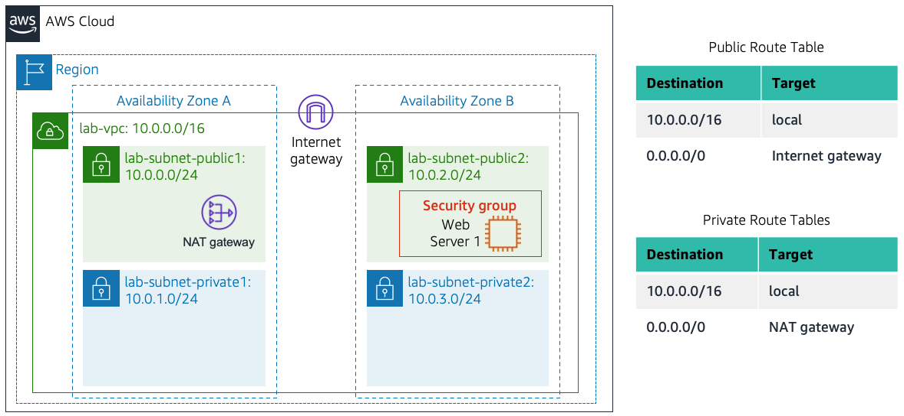

# Lab 2 – Build Your VPC and Launch a Web Server

## 1. Overview

In this lab I built a custom Amazon Virtual Private Cloud (VPC) from scratch, replacing the default VPC that AWS provides. I created public and private subnets across two Availability Zones, configured route tables with an Internet Gateway and a NAT Gateway, and set up a security group to control traffic. Finally, I launched an EC2 instance into a public subnet with a User Data script that automatically installed Apache and PHP, turning the instance into a functioning web server.

---

## 2. Objectives

After completing this lab, I was able to:

- Create a custom VPC with public and private subnets
- Create subnets in multiple Availability Zones for High Availability
- Configure a security group (virtual firewall)
- Launch an EC2 instance into a VPC
- Automate web server deployment using User Data

---

## 3. Architecture & Scenario

### Task 1: Create Your VPC

I used the **VPC and more** option in the VPC console to create multiple resources at once, including a VPC, an Internet Gateway, a public subnet and a private subnet in a single Availability Zone, two route tables, and a NAT Gateway.

**Configuration used:**

| Parameter | Value |
|-----------|-------|
| Name tag auto-generation | Auto-generate (changed "project" to "lab") |
| IPv4 CIDR block | 10.0.0.0/16 |
| Number of Availability Zones | 1 |
| Number of public subnets | 1 |
| Number of private subnets | 1 |
| Public subnet CIDR block | 10.0.0.0/24 |
| Private subnet CIDR block | 10.0.1.0/24 |
| NAT gateways | In 1 AZ |
| VPC endpoints | None |
| DNS hostnames | Enabled |

**Resources created by the wizard:**

- VPC: lab-vpc
- Public subnet: lab-subnet-public1-us-east-1a
- Private subnet: lab-subnet-private1-us-east-1a
- Public route table: lab-rtb-public
- Private route table: lab-rtb-private1-us-east-1a
- Internet Gateway: lab-igw
- NAT Gateway: lab-nat-public1-us-east-1a

> **[SCREENSHOT HERE – Insert the Task 1 result diagram]**

The NAT Gateway took a few minutes to activate. I waited until all resources were created before proceeding.

---

### Task 2: Create Additional Subnets

In this task, I created two additional subnets for the VPC in a second Availability Zone. Having subnets in multiple Availability Zones within a VPC is useful for deploying solutions that provide High Availability.

#### Steps Performed:

**1. Created second public subnet:**

| Parameter | Value |
|-----------|-------|
| VPC ID | lab-vpc |
| Subnet name | lab-subnet-public2 |
| Availability Zone | us-east-1b |
| IPv4 CIDR block | 10.0.2.0/24 |

**2. Created second private subnet:**

| Parameter | Value |
|-----------|-------|
| VPC ID | lab-vpc |
| Subnet name | lab-subnet-private2 |
| Availability Zone | us-east-1b |
| IPv4 CIDR block | 10.0.3.0/24 |

**3. Updated Private Route Table associations:**

I selected the `lab-rtb-private1-us-east-1a` route table and associated it with both private subnets:
- lab-subnet-private1 (AZ A)
- lab-subnet-private2 (AZ B)

**4. Updated Public Route Table associations:**

I selected the `lab-rtb-public` route table and associated it with both public subnets:
- lab-subnet-public1 (AZ A)
- lab-subnet-public2 (AZ B)

#### Result:

> **[SCREENSHOT HERE – Insert screenshot showing all 4 subnets in the Subnets list]**

> **[SCREENSHOT HERE – Insert screenshot of Public Route Table showing 0.0.0.0/0 → Internet Gateway]**

> **[SCREENSHOT HERE – Insert screenshot of Private Route Table showing 0.0.0.0/0 → NAT Gateway]**

My VPC now has public and private subnets configured in two Availability Zones. The route tables created in Task 1 have been updated to route network traffic for the two new subnets.

| Subnet Name | Availability Zone | CIDR | Route Table |
|-------------|-------------------|------|-------------|
| lab-subnet-public1 | us-east-1a | 10.0.0.0/24 | Public (→ IGW) |
| lab-subnet-public2 | us-east-1b | 10.0.2.0/24 | Public (→ IGW) |
| lab-subnet-private1 | us-east-1a | 10.0.1.0/24 | Private (→ NAT) |
| lab-subnet-private2 | us-east-1b | 10.0.3.0/24 | Private (→ NAT) |
