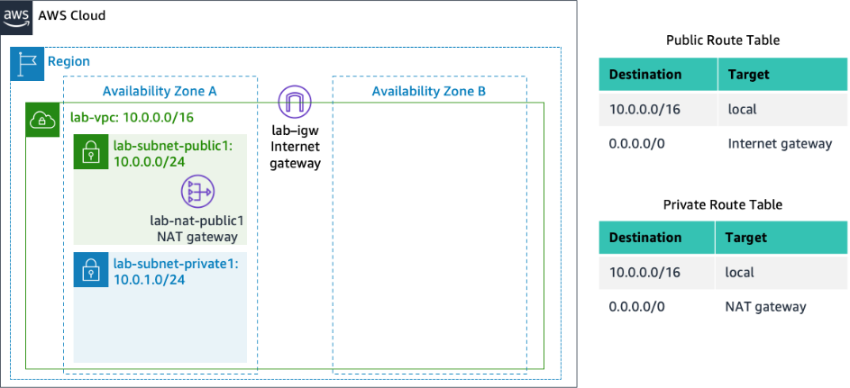

# Lab 2 – Build Your VPC and Launch a Web Server

## 1. Overview

In this lab I built a custom Amazon Virtual Private Cloud (VPC) from scratch, replacing the default VPC that AWS provides. I created public and private subnets across two Availability Zones, configured route tables with an Internet Gateway and a NAT Gateway, and set up a security group to control traffic. Finally, I launched an EC2 instance into a public subnet with a User Data script that automatically installed Apache and PHP, turning the instance into a functioning web server.

---

## 2. Objectives

After completing this lab, I was able to:

- Create a custom VPC with public and private subnets
- Create subnets in multiple Availability Zones for High Availability
- Configure a security group (virtual firewall)
- Launch an EC2 instance into a VPC
- Automate web server deployment using User Data

---

## 3. Architecture & Scenario


---

### Task 1: Create Your VPC

I used the **VPC and more** option in the VPC console to create multiple resources at once, including a VPC, an Internet Gateway, a public subnet and a private subnet in a single Availability Zone, two route tables, and a NAT Gateway.

**Configuration used:**

| Parameter | Value |
|-----------|-------|
| Name tag auto-generation | Auto-generate (changed "project" to "lab") |
| IPv4 CIDR block | 10.0.0.0/16 |
| Number of Availability Zones | 1 |
| Number of public subnets | 1 |
| Number of private subnets | 1 |
| Public subnet CIDR block | 10.0.0.0/24 |
| Private subnet CIDR block | 10.0.1.0/24 |
| NAT gateways | In 1 AZ |
| VPC endpoints | None |
| DNS hostnames | Enabled |

**Resources created by the wizard:**

- VPC: lab-vpc
- Public subnet: lab-subnet-public1-us-east-1a
- Private subnet: lab-subnet-private1-us-east-1a
- Public route table: lab-rtb-public
- Private route table: lab-rtb-private1-us-east-1a
- Internet Gateway: lab-igw
- NAT Gateway: lab-nat-public1-us-east-1a

> 

The NAT Gateway took a few minutes to activate. I waited until all resources were created before proceeding.

---

### Task 2: Create Additional Subnets

In this task, I created two additional subnets for the VPC in a second Availability Zone. Having subnets in multiple Availability Zones within a VPC is useful for deploying solutions that provide High Availability.

#### Steps Performed:

**1. Created second public subnet:**

| Parameter | Value |
|-----------|-------|
| VPC ID | lab-vpc |
| Subnet name | lab-subnet-public2 |
| Availability Zone | us-east-1b |
| IPv4 CIDR block | 10.0.2.0/24 |

**2. Created second private subnet:**

| Parameter | Value |
|-----------|-------|
| VPC ID | lab-vpc |
| Subnet name | lab-subnet-private2 |
| Availability Zone | us-east-1b |
| IPv4 CIDR block | 10.0.3.0/24 |

**3. Updated Private Route Table associations:**

I selected the `lab-rtb-private1-us-east-1a` route table and associated it with both private subnets:
- lab-subnet-private1 (AZ A)
- lab-subnet-private2 (AZ B)

**4. Updated Public Route Table associations:**

I selected the `lab-rtb-public` route table and associated it with both public subnets:
- lab-subnet-public1 (AZ A)
- lab-subnet-public2 (AZ B)

#### Result:

> **[SCREENSHOT HERE – Insert screenshot showing all 4 subnets in the Subnets list]**

> **[SCREENSHOT HERE – Insert screenshot of Public Route Table showing 0.0.0.0/0 → Internet Gateway]**

> **[SCREENSHOT HERE – Insert screenshot of Private Route Table showing 0.0.0.0/0 → NAT Gateway]**

My VPC now has public and private subnets configured in two Availability Zones. The route tables created in Task 1 have been updated to route network traffic for the two new subnets.

| Subnet Name | Availability Zone | CIDR | Route Table |
|-------------|-------------------|------|-------------|
| lab-subnet-public1 | us-east-1a | 10.0.0.0/24 | Public (→ IGW) |
| lab-subnet-public2 | us-east-1b | 10.0.2.0/24 | Public (→ IGW) |
| lab-subnet-private1 | us-east-1a | 10.0.1.0/24 | Private (→ NAT) |
| lab-subnet-private2 | us-east-1b | 10.0.3.0/24 | Private (→ NAT) |

---

### Task 3: Create a VPC Security Group

In this task, I created a VPC security group, which acts as a virtual firewall. When launching an instance, I will associate this security group with the instance to control inbound and outbound traffic.

#### Steps Performed:

1. In the VPC console, I navigated to **Security groups** in the left navigation pane.
2. I clicked **Create security group** and configured the following:

| Parameter | Value |
|-----------|-------|
| Security group name | Web Security Group |
| Description | Enable HTTP access |
| VPC | lab-vpc |

3. In the **Inbound rules** pane, I clicked **Add rule** and configured:

| Type | Source | Description |
|------|--------|-------------|
| HTTP | Anywhere-IPv4 (0.0.0.0/0) | Permit web requests |

4. I clicked **Create security group** at the bottom of the page.

#### Result:

> **[SCREENSHOT HERE – Insert screenshot of the Security Group inbound rules showing HTTP from 0.0.0.0/0]**

This security group permits HTTP (port 80) access to any associated EC2 instance from anywhere on the internet. I will use this security group in the next task when launching the web server instance.

---

### Task 4: Launch a Web Server Instance

In this task, I launched an Amazon EC2 instance into the new VPC and configured it to act as a web server using a User Data script that runs automatically when the instance starts.

#### Steps Performed:

**1. Opened EC2 Console:**

In the search box to the right of Services, I searched for and chose **EC2** to open the EC2 console.

**2. Started instance launch:**

From the **Launch instance** menu, I chose **Launch instance**.

**3. Named the instance:**

I gave it the name **Web Server 1**. When you name your instance, AWS creates a tag and associates it with the instance. A tag is a key value pair. The key for this pair is *Name*, and the value is the name you enter for your EC2 instance.

**4. Chose an AMI:**

In the list of available Quick Start AMIs, I kept the default **Amazon Linux** selected. I also kept the default **Amazon Linux 2023 AMI** selected. The type of Amazon Machine Image (AMI) you choose determines the Operating System that will run on the EC2 instance that you launch.

**5. Chose an Instance type:**

In the Instance type panel, I kept the default **t2.micro** selected. The Instance Type defines the hardware resources assigned to the instance.

**6. Selected the key pair:**

From the Key pair name menu, I selected **vockey**. The vockey key pair will allow you to connect to this instance via SSH after it has launched. Although you will not need to do that in this lab, it is still required to identify an existing key pair, or create a new one, or choose to proceed without a key pair, when you launch an instance.

**7. Configured Network settings:**

Next to Network settings, I chose **Edit** and configured:

| Parameter | Value |
|-----------|-------|
| Network | lab-vpc |
| Subnet | lab-subnet-public2 (not Private!) |
| Auto-assign public IP | Enable |

Next, I configured the instance to use the Web Security Group that I created earlier. Under **Firewall (security groups)**, I chose **Select existing security group**. For **Common security groups**, I selected **Web Security Group**. This security group will permit HTTP access to the instance.

**8. Configured storage:**

In the **Configure storage** section, I kept the default settings. The default settings specify that the root volume of the instance, which will host the Amazon Linux guest operating system, will run on a general purpose SSD (gp3) hard drive that is 8 GiB in size.

**9. Added User Data script:**

I expanded the **Advanced details** panel and scrolled to the bottom of the page. I copied and pasted the following script into the **User data** box:
```
#!/bin/bash
# Install Apache Web Server and PHP
dnf install -y httpd wget php mariadb105-server
# Download Lab files
wget https://aws-tc-largeobjects.s3.us-west-2.amazonaws.com/CUR-TF-100-ACCLFO-2/2-lab2-vpc/s3/lab-app.zip
unzip lab-app.zip -d /var/www/html/
# Turn on web server
chkconfig httpd on
service httpd start
```

This script will run with root user permissions on the guest OS of the instance. It will run automatically when the instance launches for the first time. The script installs a web server, a database, and PHP libraries, and then it downloads and installs a PHP web application on the web server.

> **[SCREENSHOT HERE – Insert screenshot of User Data script in Advanced details panel]**

**10. Launched the instance:**

At the bottom of the Summary panel on the right side of the screen, I chose **Launch instance**. I saw a **Success** message, then chose **View all instances**.

**11. Waited for instance to be ready:**

I waited until **Web Server 1** showed **2/2 checks passed** in the Status check column. This took a few minutes. I clicked the refresh icon at the top of the page every 30 seconds or so to more quickly become aware of the latest status of the instance.

**12. Tested the web server:**

I selected **Web Server 1**, then copied the **Public IPv4 DNS** value shown in the Details tab at the bottom of the page. I opened a new web browser tab, pasted the Public DNS value, and pressed Enter.

#### Result:

> **[SCREENSHOT HERE – Insert screenshot of web browser showing AWS logo and instance metadata]**

I saw a web page displaying the AWS logo and instance meta-data values.

**The complete architecture I deployed is:**

> **[SCREENSHOT HERE – Insert the complete architecture diagram]**
